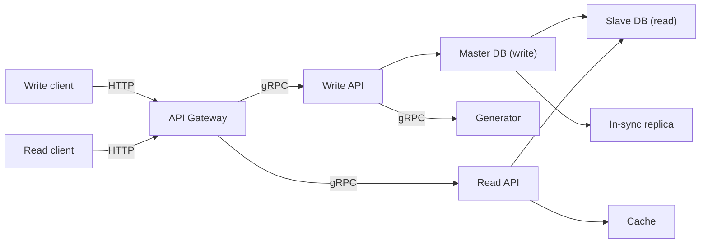
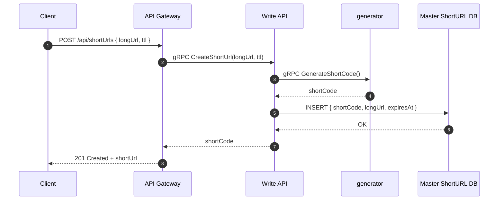
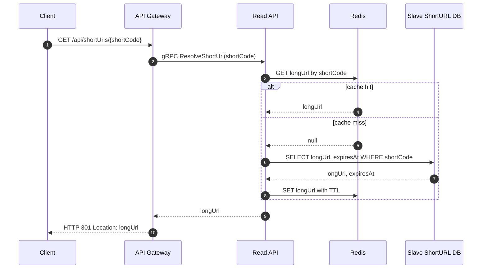
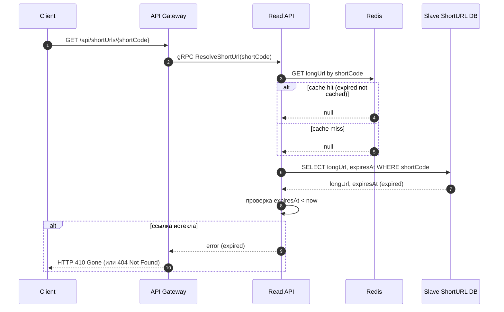

# Техническое решение проекта «URL Shortener»

## Введение
  **Цель проекта:**  
  Разработка распределённой системы генерации сокращённых URL-адресов. Система позволяет быстро и безопасно сгенерировать сокращённый URL-адрес по длинному и впоследствии перейти по адресу длинной ссылки через сокращённую.

  **Задачи:**
  1. Спроектировать архитектуру приложения.
  2. Определить доменные сущности.
  3. Реализовать базовые пользовательские сценарии (генерация сокращённого адреса по длинному; переход по сокращённому адресу). 
  4. Реализовать взаимодействие сервисов.
  5. Обеспечить отказоустойчивость и высокую производительность системы.

  **Основания для разработки:**  
  Учебный проект в рамках курса «Основы распределённых вычислений».

  **Команда:**  
  | Участник | Роль |
  |----------|------|
  | Розов Владислав | Teamlead, fullstack-разработчик |
  | Романов Арсений | Backend-разработчик, архитектор |
  | Шерстобитова Елизавета | Fullstack-разработчик, DevOps |

---

## Глоссарий
| Термин        | Определение |
|---------------|-------------|
| Пользователь  | Любой клиент, отправляющий запрос |
| Длинный (исходный) URL | Оригинальный (полный) адрес, который посылает пользователь |
| Сокращённый URL | Короткая форма исходного URL, указывающая на перенаправление на исходный |
| API Gateway | Точка входа всех клиентских запросов |
| Cache (кэш) | Быстрое хранилище для ускорения ответов |
| Реплика | Копия базы данных |
| Доступность | Свойство распределённой системы предоставлять ответ на запрос пользователя даже при отказе отдельных её компонентов |
| TTL (time-to-live) | Время действия сокращённого URL |
---

## Функциональные требования
Система должна предоставлять следующие функции:
  1. Создание сокращённого URL по исходному.
  2. Переадресация по сокращённому URL.
  3. Получение метаданных по сокращённому URL (время создания, истечения).
  4. Задание TTL.
  5. Валидация URL.

---

## Нефункциональные требования
  1. Время отклика ≤ 200мс в условиях локальной сети.
  2. Кэширование ответов на запросы чтения.
  3. Масштабируемость: разделение логических компонентов на микросервисы, репликации баз данных, распределённый кэш.
  4. Доступность > 99.9%.
  5. Отказоустойчивость: cистема продолжает раобтать при сбое одного из узлов.
  6. Согласованность: короткие URL не могут быть утеряны, гарантируется их уникальность.
  7. Поддерживаемость и расширяемость: модульность, покрытие тестами ≥ 80%.
  8. Ограничение числа запросов на пользователя.
  9. Гарантия уникальности сокращённого URL.

---

## Пользовательские сценарии
### Сценарий: Создание короткой ссылки по длинной

1. Пользователь отправляет Long URL
2. Система создаёт уникальный Short URL и возвращает его.

### Сценарий: Перенаправление по короткой ссылке на адрес длинной

1. Пользователь переходит по Short URL.
2. Система перенаправляет его на Long URL.

### Сценарий: Переход по истёшкей ссылке

1. Пользователь переходит по Short URL с истёкшим TTL.
2. Пользователь видит сообщение об ошибке/истечении срока действия.

---

##  Архитектура системы
| Компонент | Назначение |
|-----------|------------|
| API Gateway | Входная точка в систему. Отвечает за приём HTTP-запросов от write/read клиентов, маршрутизацию в соответствующие backend-сервисы по gRPC. |
| Write API | Обрабатывает запросы на создание сокращённого URL. Обращается к сервису генерации идентификаторов, валидирует входные данные и записывает результат в master-базу данных. |
| Generator | Сервис генерации коротких URL. Выдаёт уникальные короткие ключи по gRPC. Используется Write API для создания новых short URL. |
| Read API | Сервис чтения. Отвечает за получение длинного URL по сокращённому. Использует кэш для ускорения, а при промахе — обращается к реплике БД (slave). |
| Cache | Быстрое хранилище (short -> long URL) для ускорения чтения. Используется Read API. |
| Master DB | Основная база данных (write). Хранит актуальные данные о сопоставлениях URL. Принимает операции записи от Write API. |
| Un-Sync Slave | Реплика базы данных (read). Предназначена для выполнения операций чтения. Запросы от Read API идут сюда, снижая нагрузку на master. |
| In-Sync Replica | Синхронная реплика. Резервная реплика для обеспечения консистентности и восстановления после сбоев. Используется внутренними механизмами БД. |

---

## Технические сценарии
### Сценарий 1: Создание Short URL
1. Пользователь отправляет HTTP-запрос POST /api/shortUrls с длинной ссылкой и TTL.
2. API Gateway по gRPC передаёт запрос в сервис Write API.
3. Write API запрашивает у сервиса generator уникальный shortCode, сохраняет пару shortCode -> longUrl (и время истечения) в мастер-базу.
4. После успешной записи Write API возвращает shortCode в API Gateway, который отвечает клиенту 201 Created и полным коротким URL.

### Сценарий 2: Переход по Short URL
1. Пользователь переходит по короткой ссылке (например, кликает в браузере), что вызывает GET /api/shortUrls/{shortCode}.
2. API Gateway по gRPC отправляет запрос в Read API.
3. Read API сначала проверяет Redis-кеш:
   - если запись найдена — сразу берёт оттуда longUrl;
   - если нет — читает из реплики БД (Slave ShortURL DB), получает longUrl (и expiresAt), кладёт в Redis с TTL.
4. После этого Read API возвращает длинный URL в API Gateway, который отвечает клиенту редиректом HTTP 302 с заголовком Location: longUrl. Браузер автоматически перенаправляется на оригинальный ресурс.

# Сценарий: Переход по ссылке с истекшим TTL
1. Пользователь переходит по короткой ссылке, у которой уже истёк TTL.
2. Запрос идёт в API Gateway (GET /api/shortUrls/{shortCode}) и затем в Read API по gRPC.
3. Read API проверяет Redis. Для истёкших ссылок обычно записи уже нет (либо вообще не кэшируются, либо были удалены по TTL), поэтому — промах.
4. Read API читает запись из Slave ShortURL DB и получает longUrl и expiresAt.
5. Сервис сравнивает expiresAt с текущим временем:
   - если expiresAt < now, ссылка считается просроченной. Вместо редиректа Read API возвращает в API Gateway информацию об ошибке: «ссылка истекла».
6. API Gateway отвечает клиенту, например, HTTP 410 Gone.
7. Пользователь видит страницу об ошибке/истечении срока действия ссылки, редиректа на оригинальный URL не происходит.

---

## План разработки и тестирования

### Основной проект (MVP)

**Включает:**
- Реализацию API Gateway (HTTP -> gRPC, роутинг, rate limiting, валидация)
- Реализацию Write API (создание сокращённых URL, валидация)
- Реализацию Generator (генерация уникальных short-id)
- Реализацию Read API (получение длинного URL по короткому, работа с кэшем)
- Интеграцию с master DB (записи) и slave DB (чтение)
- Интеграцию с кэшем (ускорение операций чтения)
- Автоматизация деплоя, масштабирование
 
---

### **План разработки:**
1. Проектирование протоколов взаимодействия (HTTP API Gateway, gRPC-сервисы)
2. Реализация API Gateway (роутинг, rate limiting, валидация запросов)
3. Реализация Generator (генерация коротких токенов)
```
Основа — Snowflake

Генератор формирует 64-битное целое число по схеме:
[ timestamp ][ instanceId ][ sequence ]
Где:
timestamp — количество миллисекунд от заданной Epoch (фиксированной стартовой даты);
instanceId — идентификатор инстанса сервиса генерации (чтобы несколько экземпляров могли генерировать коды параллельно без коллизий);
sequence — счётчик внутри одной миллисекунды (решает коллизии, если один инстанс за одну миллисекунду генерирует несколько кодов).
Гарантия уникальности

В пределах одного инстанса:
если новый вызов генерации попадает в ту же самую миллисекунду, увеличивается sequence;
как только счётчик достигает максимума, генератор ждёт следующую миллисекунду и сбрасывает sequence в 0.
Между инстансами:
у каждого инстанса свой instanceId, поэтому даже при одинаковом времени и sequence итоговое 64-битное число разное.

Монотонность
Пока системные часы не откатываются назад, сгенерированные числа строго растут по времени.
На практике это означает, что short-коды упорядочены по времени создания (по возрастанию).

Кодирование в строку
Полученное 64-битное число кодируется в base62:
алфавит из цифр и латинских букв: 0-9, a-z, A-Z;
число последовательно делится на 62, по остаткам выбираются символы.
В результате получается короткая, URL-безопасная строка без спецсимволов (например, aZ3f9Q).

Ограничения и валидации
Генератор проверяет, что:
текущее время > Epoch (защита от «времени в прошлом»);
значение timestamp помещается в отведённое количество бит (ограничение на максимальный «срок жизни» схемы).
При нарушении этих условий генератор сигнализирует об ошибке, чтобы не выдавать потенциально конфликтующие коды.
```
4. Реализация Write API:
   - получение длинного URL
   - запрос к Generator
   - запись short->long в master DB
5. Реализация репликации master -> slave (использование возможностей готовой БД)
6. Реализация Read API:
   - чтение из кэша
   - fallback на slave DB
   - сохранение результата в кэш
7. Настройка кэша (Redis или аналог)
8. Документирование API (REST + gRPC)

---

### **План тестирования:**
- Модульные тесты:
  - генерация коротких ссылок (Generator)
  - логика валидации длинных ссылок (Write API)
  - доменные сущности
  - тестирование репозитория
- Интеграционные тесты:
  - логика записи (Write API)
  - логика чтения и кэширования (Read API)
  - API Gateway -> Write API / Read API
  - Write API -> master DB
  - Read API -> cache -> slave DB
  - Репликация master -> slave
- Нагрузочные тесты (только базовые):
  - массовые чтения (read-heavy)
  - массовые записи (write-heavy)

---

### **Definition of Done (DoD) для MVP:**
- Реализованы сценарии:
  - создание короткого URL
  - редирект по Short URL на Long URL 
- Все основные сервисы интегрированы и покрыты тестами
- Система соответствует базовым нефункциональным требованиям:
  - доступность 99.9%
  - время отклика ≤ 200мс
  - корректная работа master/slave схемы
  - кэш снижает нагрузку на БД

---

### Расширенный проект (Advanced Scope)

**Включает:**
- Аналитику (подсчёт обращений, хранение метрик, работа с отдельной analytics DB)
- Добавление очереди сообщений (Kafka) для передачи событий чтения и записи
- Масштабирование всех сервисов
- Расширенная отказоустойчивость (реплики сервисов, health-check, retries)

---

### **План разработки:**
1. Реализация Analytics Service (подписка на Kafka, запись событий в analytics DB)
2. Добавление аналитических API (количество переходов, горячие ссылки)
3. Добавление health-check, retry-политик
4. Расширенная логирование + метрики (Prometheus/Grafana)

---

### **План тестирования:**
- Интеграционные тесты Kafka:
  - публикация событий
  - обработка событий Analytics Service
- Тесты на корректность агрегированных метрик
- Тесты отказоустойчивости:
  - падение Read API / Write API
  - отставание реплики slave
  - недоступность кэша
- Нагрузочные тесты:
  - чтение 10k RPS
  - запись 2k RPS
  - стресс-тест Kafka и analytics DB

---

### **Definition of Done (DoD) для расширенного проекта:**
- Реализованы:
  - сбор аналитики переходов
  - хранение и отображение статистики
  - масштабирование всех сервисов
- Доступность ≥ 99.99%
- Время отклика ≤ 100 мс
- Система выдерживает нагрузку согласно нефункциональным требованиям
- Все функциональные и аналитические компоненты покрыты тестами

---
